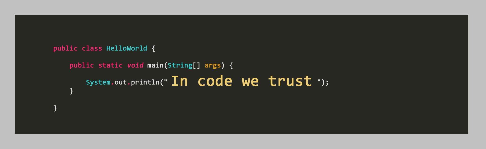

### Hi there 👋

<!--
**Bluff-0/Bluff-0** is a ✨ _special_ ✨ repository because its `README.md` (this file) appears on your GitHub profile.

Here are some ideas to get you started:

- 🔭 I’m currently working on ...
- 🌱 I’m currently learning ...
- 👯 I’m looking to collaborate on ...
- 🤔 I’m looking for help with ...
- 💬 Ask me about ...
- 📫 How to reach me: ...
- 😄 Pronouns: ...
- ⚡ Fun fact: ...
-->

## About Me

> 
Just know that I'm always Parallel on the other side

- 🔭 I’m currently working on Signal Processing and BCI
- 🌱 Learning Creative programming and Ext
---

  
  
  
  
  
  

 

  
  
  
  
  

  
  &nbsp;
  

---

## Skillset

| Domain                   | Technologies |  Proficiency |
| ---------------          |-------------:|-------------:|
|Operating Systems         |   |  |
| Languages                |      |  |
| Web Development          |            |  |
| Cloud Development        |  |  |
| Server                   |      |  |
| Version Control          |   |  |
| Database                 |    |  |
| Tools and Softwares      |   |  |
| Machine Learning and Signal Processing |         |  |
| Web Scrapping |   |  |
